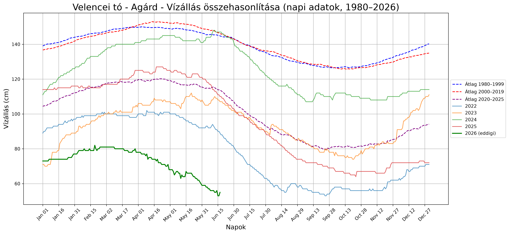
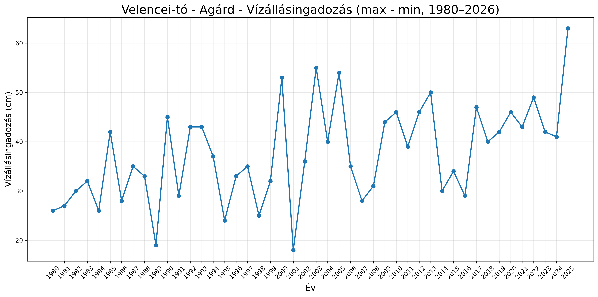
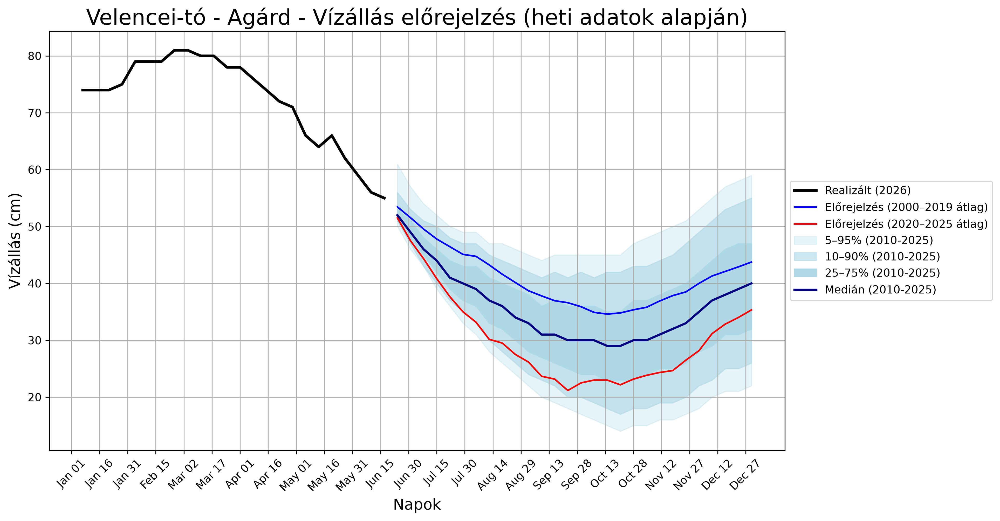

# water-level repository

## TLTR:
2026 májusában és júniusában sok szó esett a Velencei-tó vízállásáról. A szakértők és a sajtó többnyire pontbecsléseket közöltek, például azt, hogy a nyár végére a vízállás akár 30 cm-re is csökkenhet. Az ilyen előrejelzések azonban nem mutatják meg, mekkora bizonytalanság övezi a várható értékeket.

Ennek az elemzésnek a célja, hogy egy egyszerű bootstrap módszertan segítségével ne csak pontbecsléseket, hanem intervallumbecsléseket is készítsen a Velencei-tó várható vízállására. Az eredményeket legyeződiagramok szemléltetik, amelyek a várható vízállások lehetséges alakulását és az előrejelzésekhez kapcsolódó bizonytalanságot is bemutatják.

## Elemzés:
Az elemzéshez a Velencei-tó 1980-tól kezdődően nyilvánosan elérhető vízállásadatait használtam fel. Ezt az időpontot azért választottam kiindulási évnek, mert a tó medre nagyjából ekkorra nyerte el a mai állapotának megfelelő formáját. Az adatok a vízügy nyilvános adatbázisából érhetők el: https://data.vizugy.hu/.

Az első ábra a Velencei-tó hosszú távú átlagos vízállását, valamint az elmúlt években mért értékeket mutatja be. Jól látható, hogy a 2026-os vízállás jelentősen elmarad a korábban tapasztalt szintektől, és a különbség nem is csekély.

A vizsgált időszak során az éves maximum és minimum vízállás közötti különbség fokozatosan növekedett.

## Előrejelzés
A legyeződiagramok elkészítéséhez heti gyakoriságú adatokat használtam. Az előrejelzés alapját a korábbi évek (2010 - 2025) azonos heteiben megfigyelt vízszintváltozások adják, amelyekből bootstrap mintavétellel véletlenszerű realizációkat generálok. Az egyes szimulációkban a heti vízszintváltozások kumulált összege határozza meg a vízállás időbeli alakulását. A bemutatott ábrák 10 000 véletlen realizáció eredményei alapján készültek. 

Az alábbi ábra az előrejelzés eredményeit mutatja be. Az utolsó megfigyelt adat 2026. június 17-éről származik, amikor az agárdi vízmércén 55 cm-es vízállást mértek. Az előrejelzés első időpontja 2026. június 24., és az év végéig terjed.

A szimulált vízálláspályák mediánja alapján a vízállás az év második felében várhatóan 30 cm alá csökken. A 2000–2019 közötti időszak átlagos vízállásváltozásai alapján készített becslés ennél magasabb, míg a 2020–2025 közötti évek adataira épülő becslés lényegesen alacsonyabb vízállási szinteket vetít előre (~20 cm).

A bizonytalansági intervallumokból az is látható, hogy a nyár közepén a szimulációk körülbelül 5%-ában haladja meg a vízállás az 45 cm-t. Hasonló valószínűséggel, nagyjából az esetek 5%-ában fordul elő az is, hogy a vízállás 15 cm-re vagy annál alacsonyabb szintre csökken. Ez jól érzékelteti az előrejelzéshez kapcsolódó bizonytalanságot, ugyanakkor arra is utal, hogy a magasabb vízállási forgatókönyvek viszonylag kis valószínűségűek.

## Észrevételek, hiányosságok
A saját unaloműzésemre készített elemzésnek talán több hiányossága van, mint erénye.

Az alkalmazott módszer nem veszi figyelembe a várható időjárási körülményeket, a tó aktuális víztömegét, a vízgyűjtő területen lehulló csapadékot, valamint az esetleges mesterséges vízpótlások hatásait. Ezek mind jelentősen befolyásolhatják a tényleges vízállás alakulását.

Ennél is fontosabb korlát lehet, hogy a történelmi adatokból származó vízszintváltozások nem feltétlenül alkalmazhatók ilyen rendkívül alacsony vízállások mellett. A tó medre nem egyenletes, ezért nagyon alacsony vízszinteknél a Velencei-tó egy összefüggő vízfelület helyett akár kisebb tavak és vízterek hálózatára is széteshet.

Emiatt könnyen elképzelhető, hogy a fenti előrejelzés túlzottan optimista. Alacsony vízállás esetén ugyanis a kisebb víztömeg gyorsabban felmelegedhet, ami fokozott párolgáshoz vezethet. Ez olyan visszacsatolást eredményezhet, amelyet a jelenlegi modell sehogy sem kezel, és amely a tényleges vízállást a becsültnél alacsonyabb szintre is lökheti.

Bebesi László

2026.06.17, Budapest
